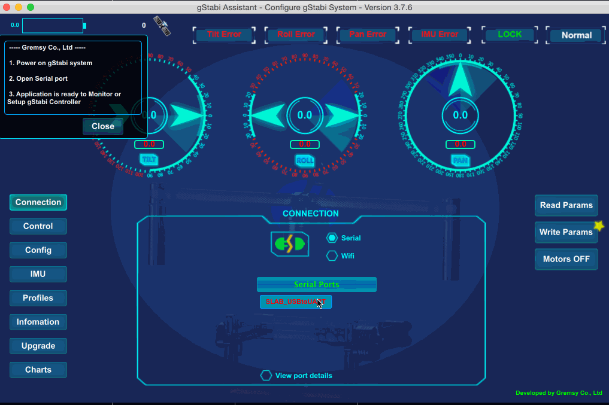

# gStabi-H3-Firmware
Firmware for gStabi H3 system developed and made by Gremsy Co., Ltd, made in Vietnam

# Download firmware
Download the latest version [here](https://github.com/Gremsy/gStabi-H3-Firmware/releases)

# Install on gStabi System controller
## Prepare:
- Download [gStabiAssistant Software](https://github.com/Gremsy/gStabi-Software/releases)
- [Download USB Driver](https://www.silabs.com/products/mcu/Pages/USBtoUARTBridgeVCPDrivers.aspx)
- Disconnect/Unplug Remote Receiver, e.g: SBUS, PPM, Spektrum,... receiver

- Connect gStabi system to your Laptop, PC or Mac
- Switch on the system, DON'T Turn Motors on

## Doing:
 - Follow instruction on the software screen

## After:
### Reset system:
#### 2 options:
1/ Using software --> Connection --> Disconnect and Connect again to reset system

2/ Hard reset: Swith Off and On again.

## HowTo Video:

# Support:
Email: support@gremsy.com

Website: www.gremsy.com

